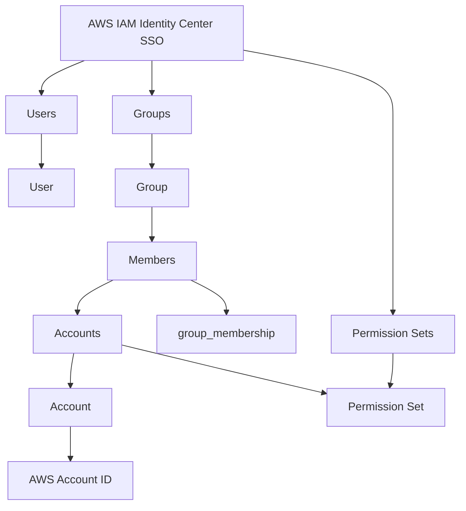

# otf-iac-aws-sso
OpenTofu AWS SSO - A IAM Identity Center SSO Self-Service Automation  

## Overview



There are 3 resources to be configured:  
- Users  
- Groups  
- Permission Sets  

## Users  
This is where users are created. After the users are created, login to the AWS SSO Start page and key in your email. The setup process will be guided by AWS for password creation and MFA device registration.  

The format to create a user is specified as follows:  
```yaml  
<Email Address>:  
  name:  
    given_name: <First Name or English Name>  
    family_name: <Last Name or Vietnamese Full Name>  
  organization: <FPT/CDG/PMG/etc.>  
  tags:  
    effective_date: <Ticket Creation date>  
    ticket_id: <JIRA Ticket ID>  
  title: <Job Role: Solution Architect/Backend Developer/Data Engineer/etc.>  
```


## Groups
A group's member definition contains a list of users who belong to that group, and the group is also associated with a preconfigured permission set that is assigned to a particular AWS account. As a result, users who are members of the group will be granted access to the AWS account with the specified permission set.
When requesting access, users are added as a member to each group. The example for adding a user to a group is as follows:

```yaml
Dev:  
  description: Developers access  
  accounts:  
    "012345678912":  
      permission_set: AWSPowerUserAccess  
  members:  
    - <User Email>
```

## Permission Set
Permission Set is a collection of permissions that determine what a user or group of users can access in an AWS account or application. These permissions can be predefined by AWS or customized to meet specific business needs and can include various types of permissions, such as IAM policies, AWS service permissions, and SAML-based application permissions, which define the actions users can perform on AWS resources.
This is pre-defined and should not be modified by external parties.

```yaml
access-ec2-s3:  
  description: "Access to S3 and EC2 services with read-only and launch permissions"  
  session_duration: "PT4H"  
  managed_policies:  
    - "ReadOnlyAccess"  
    - "AmazonEC2ReadOnlyAccess"  
  customer_managed_policies:  
    - policy: "CustomS3ReadAccess"  
      path: "/custom/"  
    - policy: "CustomEC2LaunchAccess"  
      path: "/custom/"
```
**Explanation**:

- **example-permission-set**: This is the identifier for the permission set.

- **description**: A short description of what this permission set allows the user to do. In this example, it provides access to S3 and EC2 services with specific capabilities.

- **session_duration**: Specifies the length of time that a single sign-on session is valid for this permission set. The value must adhere to ISO 8601 duration format, such as "PT4H" for 4 hours.

- **managed_policies**: A list of AWS managed policies that are attached to the permission set. In this example, it includes ReadOnlyAccess and AmazonEC2ReadOnlyAccess.

- **customer_managed_policies**: A list of customer-managed policies to attach to the permission set. Each entry specifies the policy name and the path where the policy is located. These policies are custom ones that you, as the account owner, manage and define.

This YAML structure allows for defining the set of permissions that users will receive when they are assigned this permission set through AWS IAM Identity Center. Adjust the policies according to your specific needs and AWS environment.
